<div align="center">

<br/>

<picture>
  <source media="(prefers-color-scheme: dark)" srcset="assets/readme/final_svgs/01_system_overview.svg"/>
  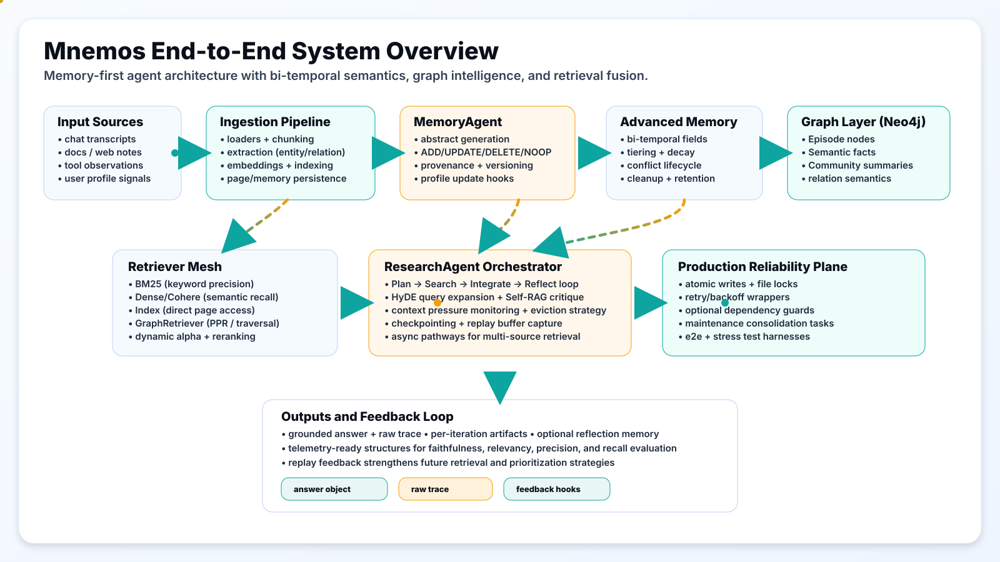
</picture>

<br/>

# MNEMOS

### Just-in-time memory system for AI agents

Self-editing bi-temporal memory · hybrid 6-signal retrieval fusion · temporal graph reasoning
Plan → Search → Integrate → Reflect loop for evidence-grounded answers

<br/>

[](https://www.python.org/downloads/)
[](LICENSE)
[]()

[](#self-editing-memory-and-conflict-resolution)
[](#bi-temporal-semantics-and-temporal-filtering)
[](#graph-memory-and-knowledge-semantics)
[](#retrieval-fusion-and-ranking-math)
[](#adaptive-context-manager)
[](#ecl-pipeline)
[](#research-path-deep-dive)

<br/>

**Author:** [Dev Chiniwala](https://github.com/DevChiniwala)

<br/>

</div>

---

## Features

MNEMOS is a memory-first runtime for AI agents that need durable knowledge, temporal correctness, and retrieval that works under real context pressure.

Most memory systems fail gradually for one of three reasons:

1. They only append new memories, so stale or wrong facts remain active forever.
2. They store time as metadata but do not enforce temporal validity during retrieval.
3. They optimize one retrieval mode (dense or sparse) and lose robustness on real query diversity.

MNEMOS directly addresses these failure modes with:

- A **self-editing memory lifecycle** (`ADD`, `UPDATE`, `DELETE`, `NOOP`).
- A **bi-temporal memory model** (`t_created`, `t_observed`, `t_valid`, `t_invalid`, `t_expired`).
- A **hybrid 6-signal retrieval stack** (semantic + lexical + graph + time_decay + cognitive + tier) with configurable weights and min-max normalization.
- A **looped research process** (plan → search → integrate → reflect) instead of one-shot generation.
- **Graph memory** with entity semantics, provenance edges, and Personalized PageRank for associative recall.
- **Adaptive context packing** with tiktoken-precise token budgets, trigram deduplication, and LLM compression fallback.
- **ECL ingestion pipeline** (Extract, Cognify, Load) that enriches every memory with emotional salience and FSRS baselines at write-time.

This README is intentionally long and deep. It is meant to make a new contributor productive quickly, and to make an architecture reviewer confident that the system has real technical substance.

---

### Who This Repo Is For

- Agent framework developers who need long-horizon memory that does not rot.
- Applied AI engineers shipping production assistants with dynamic context limits.
- Researchers exploring memory quality under temporal drift and contradictory inputs.
- Platform teams that need explainable, provenance-aware retrieval instead of opaque embeddings only.

---

### What's Included

This repository currently includes:

- Core package: `mnemos/`
- Examples: `examples/quickstart/`
- Evaluation entrypoints: `eval/`
- Test suite (TTL-centric): `tests/`
- Operational scripts: `scripts/`
- Visual assets and architecture SVGs: `assets/readme/`
- Packaging: `setup.py`, `pyproject.toml`, `requirements.txt`

Notes on current state:

- Dependencies are declared in `requirements.txt` and `pyproject.toml`.
- Test coverage is strongest for TTL/persistence behavior; broader end-to-end benchmark automation is present as evaluation entrypoints and should be extended per deployment needs.

---

### Table of Contents

1. [Features](#features)
2. [Visual Architecture](#visual-architecture)
3. [Quickstart](#quickstart)
4. [Configuration](#configuration)
5. [System Thesis and Design Principles](#system-thesis-and-design-principles)
6. [High-Level Architecture](#high-level-architecture)
7. [End-to-End Lifecycle](#end-to-end-lifecycle)
8. [Data Contracts and Schemas](#data-contracts-and-schemas)
9. [Memory Write Path Deep Dive](#memory-write-path-deep-dive)
10. [Research Path Deep Dive](#research-path-deep-dive)
11. [Bi-Temporal Semantics and Temporal Filtering](#bi-temporal-semantics-and-temporal-filtering)
12. [Self-Editing Memory and Conflict Resolution](#self-editing-memory-and-conflict-resolution)
13. [Hierarchical Tiers and Decay Mechanics](#hierarchical-tiers-and-decay-mechanics)
14. [Retrieval, Fusion, and Ranking Math](#retrieval-fusion-and-ranking-math)
15. [Adaptive Context Manager](#adaptive-context-manager)
16. [ECL Pipeline](#ecl-pipeline)
17. [Graph Memory and Knowledge Semantics](#graph-memory-and-knowledge-semantics)
18. [Ingestion Pipeline and Document Processing](#ingestion-pipeline-and-document-processing)
19. [User Profile Modeling](#user-profile-modeling)
20. [Maintenance Jobs: Consolidation and Summarization](#maintenance-jobs-consolidation-and-summarization)
21. [Reliability: Async, Checkpointing, Replay](#reliability-async-checkpointing-replay)
22. [Evaluation and Testing](#evaluation-and-testing)
23. [Configuration Reference](#configuration-reference)
24. [Repository Structure](#repository-structure)
25. [Operational Playbook for Production](#operational-playbook-for-production)
26. [Performance Tuning Guide](#performance-tuning-guide)
27. [Known Gaps and Recommended Next Steps](#known-gaps-and-recommended-next-steps)
28. [FAQ](#faq)
29. [Architecture SVGs](#architecture-svgs)
30. [Additional Documentation in This Repo](#additional-documentation-in-this-repo)
31. [License](#license)
32. [Acknowledgments](#acknowledgments)
33. [Support](#support)

---

## Visual Architecture

### Storyboard Frames

All frames below use the same visual language: light background, controlled accent colors, and high-legibility technical composition.

<p align="center">
  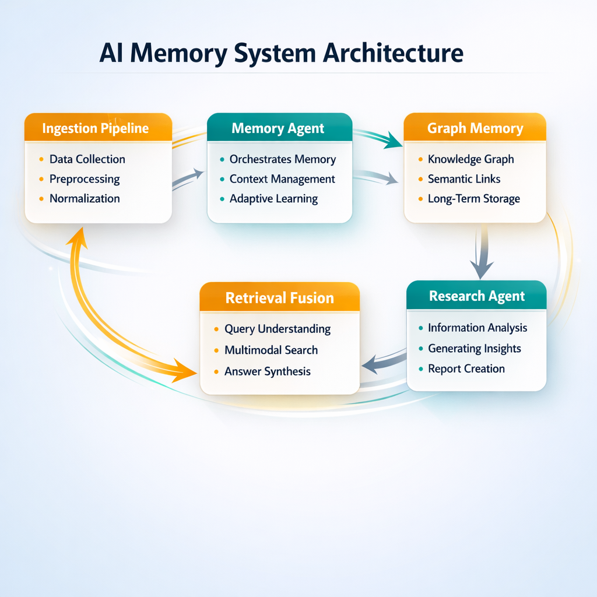
  
  
</p>

<p align="center">
  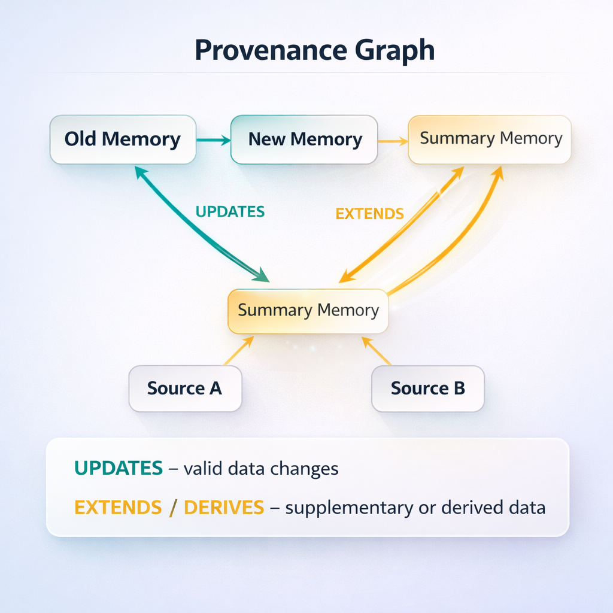
  
  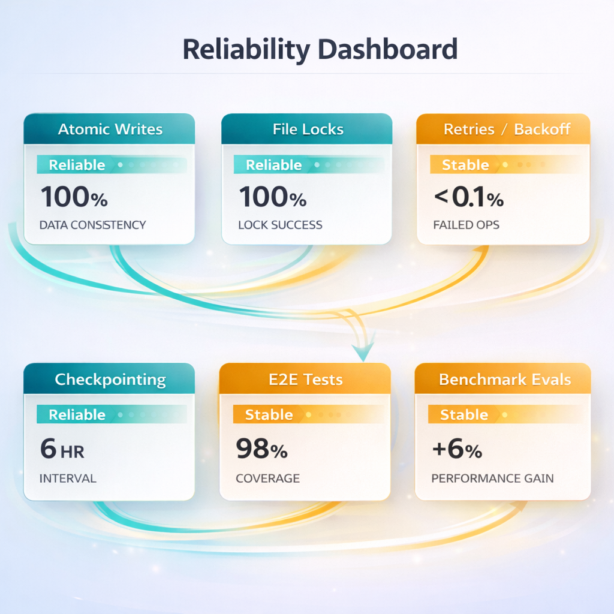
</p>

### Animated Architecture SVG Pack

<p align="center">
  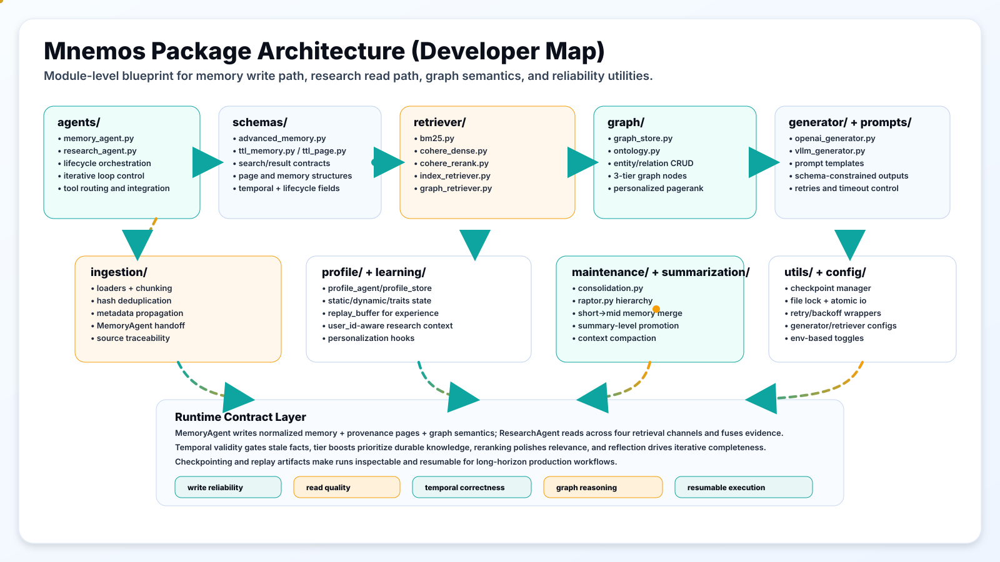
  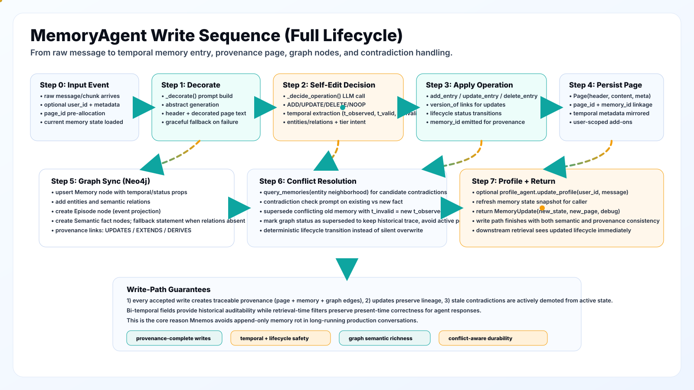
</p>

<p align="center">
  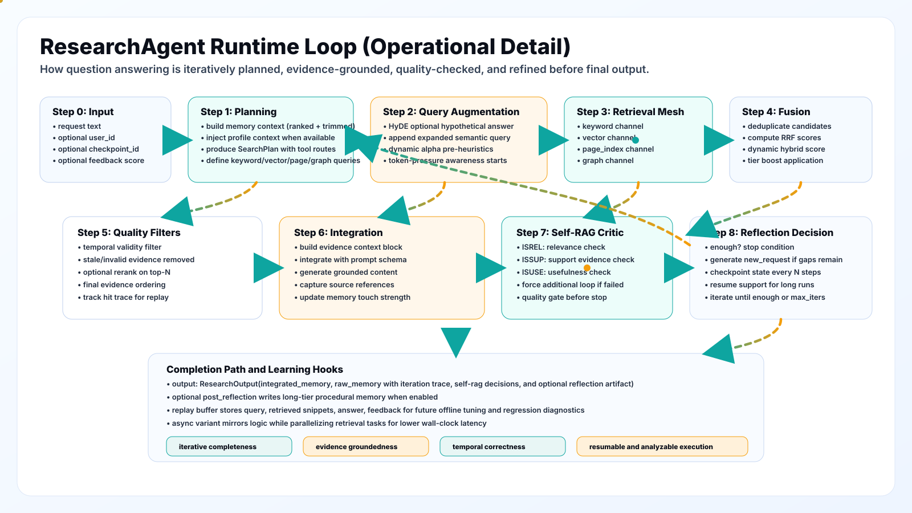
  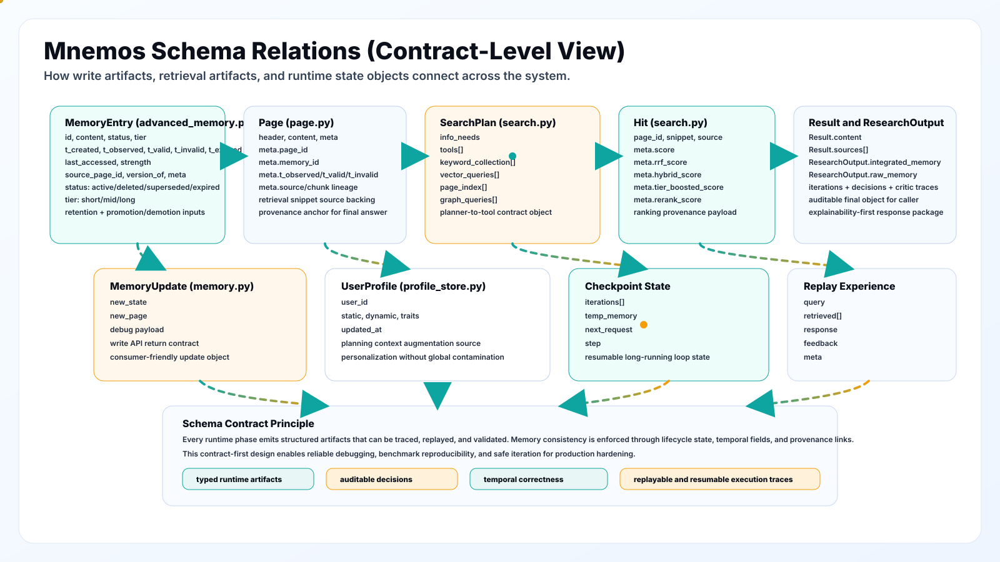
</p>

<p align="center">
  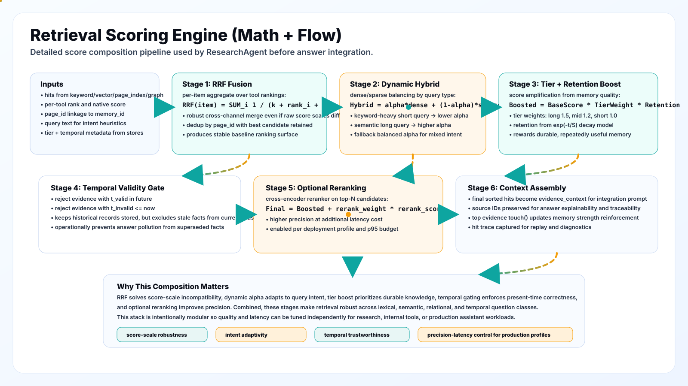
  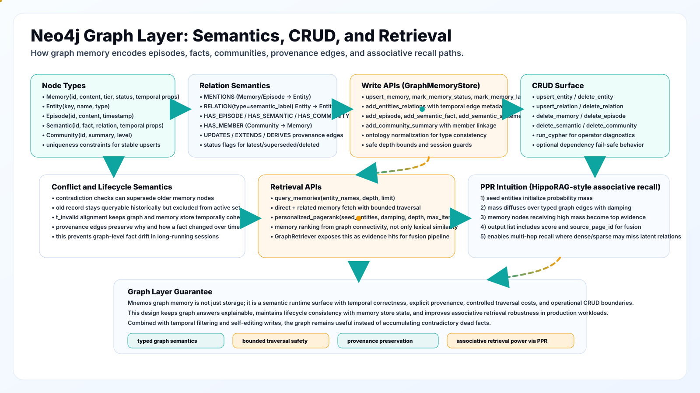
</p>

### Phase 7 Architecture SVGs

<p align="center">
  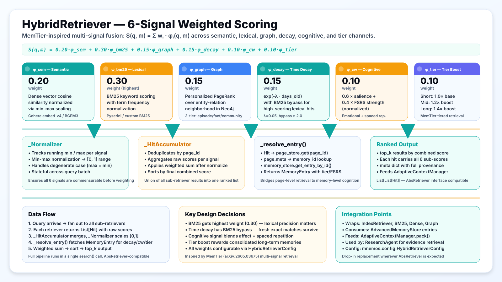
</p>

<p align="center">
  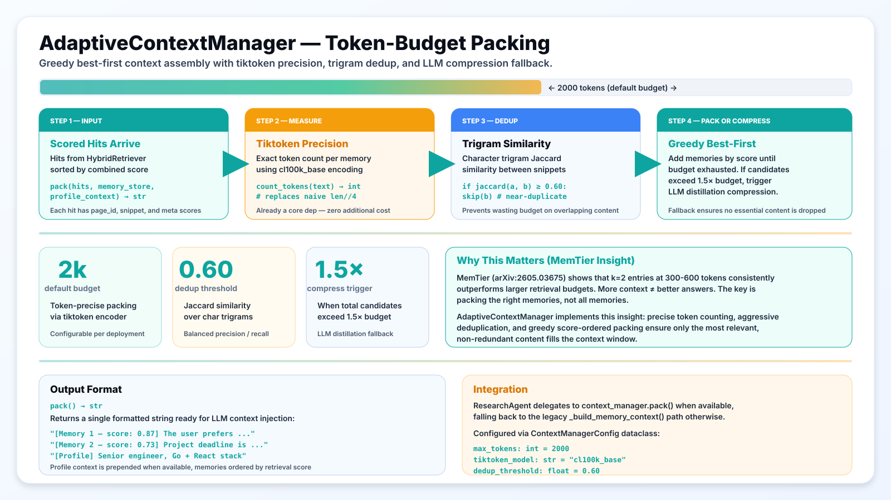
</p>

<p align="center">
  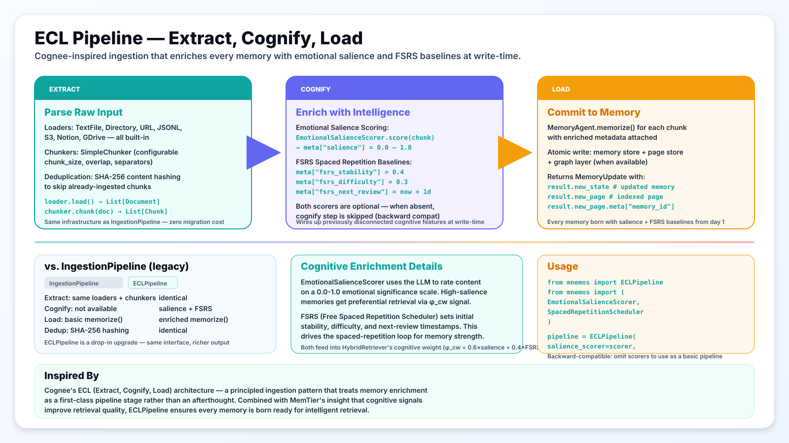
</p>

---

<a id="quickstart"></a>
## Quickstart

### 1) Create virtual environment

```bash
python3 -m venv .venv
source .venv/bin/activate
python3 -m pip install --upgrade pip
```

### 2) Install package and dependencies

```bash
pip install -e .
pip install -r requirements.txt
```

Optional sparse retriever dependency:

```bash
pip install pyserini
```

### 3) Export environment variables

```bash
export OPENROUTER_API_KEY="..."
export OPENROUTER_BASE_URL="https://openrouter.ai/api/v1"

export COHERE_API_KEY="..."
export COHERE_BASE_URL="https://api.cohere.com"
```

Optional: local Neo4j (recommended for development)

```bash
./scripts/neo4j_local_up.sh

export NEO4J_URI="bolt://localhost:7687"
export NEO4J_USERNAME="neo4j"
export NEO4J_PASSWORD="mnemos_local_password"
export NEO4J_DATABASE="neo4j"
```

Place your MNEMOS state in local graph:

```bash
export MNEMOS_DIR_PATH="/tmp/mnemos_test"
export MNEMOS_MODEL="google/gemini-3-flash-preview"  # default; override per-env as needed
```

Drop local Neo4j:

```bash
./scripts/neo4j_local_down.sh
```

### 4) Minimal end-to-end example

```python
import os
from mnemos import (
    MemoryAgent,
    ResearchAgent,
    OpenAIGenerator,
    OpenAIGeneratorConfig,
    AdvancedMemoryStore,
    InMemoryPageStore,
    CohereDenseRetriever,
    CohereEmbedRetrieverConfig,
    CohereReranker,
    CohereRerankerConfig,
    BM25Retriever,
    BM25RetrieverConfig,
    IndexRetriever,
    IndexRetrieverConfig,
)

# --- Generator ---
generator = OpenAIGenerator.from_config(
    OpenAIGeneratorConfig(
        model_name="google/gemini-3-flash-preview",
        api_key=os.getenv("OPENROUTER_API_KEY"),
        base_url="https://openrouter.ai/api/v1",
        temperature=0.3,
    )
)

# --- Stores ---
memory_store = AdvancedMemoryStore()
page_store = InMemoryPageStore()

# --- MemoryAgent ---
memory_agent = MemoryAgent(
    generator=generator,
    memory_store=memory_store,
    page_store=page_store,
)

# --- Memorize documents ---
documents = [
    "Artificial intelligence (AI) is a branch of computer science focused on building systems "
    "that can perform tasks that typically require human intelligence.",
    "Deep learning is a subset of machine learning that uses multi-layer neural networks.",
    "The Transformer architecture transformed NLP and enabled large language models such as GPT and BERT.",
]

for doc in documents:
    memory_agent.memorize(doc)

# --- Build retrievers ---
retrievers = {}

# Index retriever (always available)
index_retriever = IndexRetriever(IndexRetrieverConfig(index_dir="./index/index").__dict__)
index_retriever.build(page_store)
retrievers["page_index"] = index_retriever

# BM25 retriever (optional — requires pyserini)
try:
    bm25_retriever = BM25Retriever(BM25RetrieverConfig(index_dir="./index/bm25").__dict__)
    bm25_retriever.build(page_store)
    retrievers["keyword"] = bm25_retriever
except Exception:
    pass

# Cohere dense retriever (optional — requires COHERE_API_KEY)
try:
    dense_config = CohereEmbedRetrieverConfig(
        index_dir="./index/cohere_dense",
        api_key=os.getenv("COHERE_API_KEY"),
    )
    dense_retriever = CohereDenseRetriever(dense_config.__dict__)
    dense_retriever.build(page_store)
    retrievers["vector"] = dense_retriever
except Exception:
    pass

# Optional reranker
reranker = None
try:
    reranker = CohereReranker(
        CohereRerankerConfig(api_key=os.getenv("COHERE_API_KEY")).__dict__
    )
except Exception:
    pass

# --- HybridRetriever (Phase 7) ---
from mnemos import HybridRetriever, HybridRetrieverConfig

hybrid_cfg = HybridRetrieverConfig()
hybrid_retriever = HybridRetriever(
    config={"hybrid": {
        "weights": hybrid_cfg.weights,
        "decay_lambda": hybrid_cfg.decay_lambda,
        "top_k": hybrid_cfg.top_k,
    }},
    retrievers=retrievers,
    memory_store=memory_store,
    page_store=page_store,
)

# --- AdaptiveContextManager (Phase 7) ---
from mnemos import AdaptiveContextManager, ContextManagerConfig

ctx_cfg = ContextManagerConfig()
context_manager = AdaptiveContextManager(
    max_tokens=ctx_cfg.max_tokens,
    tiktoken_model=ctx_cfg.tiktoken_model,
    generator=generator,
    dedup_threshold=ctx_cfg.dedup_threshold,
)

# --- ResearchAgent ---
research_agent = ResearchAgent(
    generator=generator,
    memory_store=memory_store,
    page_store=page_store,
    retrievers={"page_index": index_retriever, "hybrid": hybrid_retriever},
    reranker=reranker,
    max_iters=3,
    enable_hyde=False,
    enable_self_rag=True,
    context_manager=context_manager,
)

# --- Research ---
result = research_agent.research("What are the key ideas behind transformers and deep learning?")
print(result.integrated_memory)

# --- ECL Pipeline (Phase 7) ---
from mnemos import ECLPipeline

ecl = ECLPipeline()  # basic mode (no cognitive enrichment)
# With cognitive enrichment:
# from mnemos import EmotionalSalienceScorer, SpacedRepetitionScheduler
# ecl = ECLPipeline(
#     salience_scorer=EmotionalSalienceScorer(generator=generator),
#     scheduler=SpacedRepetitionScheduler(),
# )

# Access memory state
entries = memory_store.get_entries()
for entry in entries:
    print(f"  [{entry.tier}] {entry.status}: {entry.content[:80]}...")
```

### 5) Run included examples

```bash
python3 examples/quickstart/basic_usage.py
python3 examples/quickstart/model_usage.py
python3 examples/quickstart/ttl_usage.py
```

### 6) Run tests (unit + optional live E2E)

```bash
./scripts/test_all.sh
```

Optional heavier live stress harness:

```bash
python3 scripts/e2e_stress_live_test.py
```

For developers (build from source):

```bash
pip install -e ".[dev,eval]"
python3 -m pytest -q
```

---

<a id="configuration"></a>
## Configuration

MNEMOS is environment-first.

Minimum setup:

- Generation: `OPENROUTER_API_KEY` (+ optional `OPENROUTER_BASE_URL`)
- Embeddings/rerank: `COHERE_API_KEY`
- Graph memory (optional): `NEO4J_URI`, `NEO4J_USERNAME`, `NEO4J_PASSWORD`, `NEO4J_DATABASE`

For the full configuration surface (including model knobs, retrieval fusion weights, temporal windows, tiering/decay, and graph traversal limits), see:

- [Configuration Reference](#configuration-reference)
- `mnemos/config/`

---

## System Thesis and Design Principles

MNEMOS is designed around five principles:

1. **Memory must edit itself.** Append-only stores accumulate contradictions. Every write classifies the incoming fact against existing state and chooses ADD/UPDATE/DELETE/NOOP. Old versions are preserved but marked inactive.

2. **Time is not metadata — it is structure.** Every memory carries five temporal coordinates that define when the fact was observed, when it became valid, and when it stopped being valid. Retrieval always filters on temporal windows, so stale facts are structurally excluded from results.

3. **Retrieval must be multi-signal.** No single retrieval mode dominates across all query types. BM25 is precise for known terms. Dense embeddings capture semantic similarity. Graph traversal reveals associative connections. Temporal decay favors recency. Cognitive weight favors emotionally salient or well-rehearsed memories. Tier boost rewards consolidation. All six signals are normalized and combined in a configurable weighted sum.

4. **Context budgets are finite and must be respected.** More retrieved content does not mean better answers. Token-precise packing with deduplication and optional LLM compression ensures only the most relevant, non-redundant content fills the context window.

5. **Research is iterative, not one-shot.** A single retrieval pass frequently misses relevant evidence. The plan → search → integrate → reflect loop refines search strategy based on what was found, continuing until the evidence is sufficient or the iteration limit is reached.

---

## High-Level Architecture

```
┌───────────────────────────────────────────────────────────────────┐
│                        MNEMOS Runtime                             │
│                                                                   │
│  ┌──────────────┐    ┌────────────────┐    ┌──────────────────┐  │
│  │ MemoryAgent  │───▶│ AdvancedMemory │◀───│  ResearchAgent   │  │
│  │              │    │     Store       │    │                  │  │
│  │ • memorize() │    │ • bi-temporal   │    │ • research()     │  │
│  │ • ADD/UPD/   │    │ • tiers+decay  │    │ • plan→search→   │  │
│  │   DEL/NOOP   │    │ • versioning   │    │   integrate→     │  │
│  │ • provenance │    │ • hard_delete  │    │   reflect loop   │  │
│  └──────┬───────┘    └───────┬────────┘    └────────┬─────────┘  │
│         │                    │                      │             │
│         ▼                    ▼                      ▼             │
│  ┌──────────────┐    ┌────────────────┐    ┌──────────────────┐  │
│  │  PageStore   │    │  GraphMemory   │    │ HybridRetriever  │  │
│  │ (in-memory/  │    │  (Neo4j)       │    │ (6-signal)       │  │
│  │  persistent) │    │ • 3-tier graph │    │ + AdaptiveContext │  │
│  └──────────────┘    │ • PPR traverse │    │   Manager         │  │
│                      └────────────────┘    └──────────────────┘  │
│                                                                   │
│  ┌──────────────┐    ┌────────────────┐    ┌──────────────────┐  │
│  │ ECL Pipeline │    │  Cognitive     │    │   Server Layer   │  │
│  │ Extract →    │    │ • salience     │    │ • FastAPI routes │  │
│  │ Cognify →    │    │ • FSRS sched.  │    │ • MCP protocol  │  │
│  │ Load         │    │ • affect model │    │ • Prometheus     │  │
│  └──────────────┘    └────────────────┘    └──────────────────┘  │
└───────────────────────────────────────────────────────────────────┘
```

<p align="center">
  
</p>

---

## End-to-End Lifecycle

A message enters MNEMOS and proceeds through this lifecycle:

1. **Ingestion** — Raw text is loaded, chunked, deduplicated, and (optionally) cognitively enriched via the ECL pipeline.

2. **Memorization** — `MemoryAgent.memorize()` generates an abstract, classifies the operation (ADD/UPDATE/DELETE/NOOP), sets bi-temporal fields, and persists to memory store + page store.

3. **Research Request** — `ResearchAgent.research()` receives a query and enters the iterative loop:
   - **Plan:** Generate a search strategy based on the query and current evidence.
   - **Search:** Fan out queries to HybridRetriever (6-signal scoring across all sub-retrievers).
   - **Integrate:** Pack results into a token-bounded context via AdaptiveContextManager and synthesize an answer.
   - **Reflect:** Evaluate whether the evidence is sufficient. If not, refine the plan and loop.

4. **Maintenance** — Background jobs run tier promotion/demotion, strength decay, expired entry cleanup, and consolidation (summarizing related short-term memories into long-term ones).

<p align="center">
  
</p>

---

## Data Contracts and Schemas

### MemoryEntry

```python
class MemoryEntry(BaseModel):
    id: str                          # Stable UUID
    content: str                     # Abstract text
    status: MemoryStatus             # "active" | "deleted" | "superseded" | "expired"
    tier: MemoryTier                 # "short" | "mid" | "long"

    # Bi-temporal fields
    t_created: str                   # When stored
    t_observed: str                  # When fact was observed in the world
    t_valid: Optional[str]           # Start of validity window
    t_invalid: Optional[str]         # End of validity window (null = still valid)
    t_expired: Optional[str]         # When superseded or deleted

    # Strength/decay
    last_accessed: Optional[str]     # Last retrieval time
    strength: float                  # Current decay strength (1.0 = fresh)

    # Provenance
    source_page_id: Optional[str]    # Which page this came from
    version_of: Optional[str]        # Previous version's ID
    meta: Dict[str, Any]             # Extensible metadata
```

### AdvancedMemoryStore

| Method | Description |
|:---|:---|
| `get_entries(include_inactive=False)` | All memory entries, optionally including deleted/expired |
| `get_entry_by_id(id)` | Single entry lookup by UUID |
| `add_entry(entry)` | Append new entry to state |
| `delete_entry(id)` | Soft delete — sets `t_expired`, status → "deleted" |
| `hard_delete_entry(id)` | GDPR Article 17 — permanently removes from state |
| `get_version_history(id)` | Full version chain for an entry |
| `query_as_of(timestamp)` | Bi-temporal point-in-time query |
| `touch(id)` | Update `last_accessed` (affects decay scoring) |
| `cleanup_expired()` | Remove entries past retention threshold |
| `promote_demote()` | Tier transitions based on age + strength |

### MemoryUpdate (return from memorize)

```python
class MemoryUpdate:
    new_state: MemoryState       # Updated memory state
    new_page: Page               # Indexed page with metadata
    debug: Dict[str, Any]        # Operation details

# Access memory ID via:
result.new_page.meta.get("memory_id")
```

### Hit (retrieval result)

```python
class Hit:
    page_id: str                 # Which page matched
    snippet: str                 # Matched text content
    source: str                  # Which retriever produced this hit
    meta: Dict[str, Any]         # Scores: sem_score, bm25_score, graph_score, etc.
```

### Page

```python
class Page:
    page_id: str
    body: str
    meta: Dict[str, Any]         # Contains memory_id, source, timestamps
```

---

## Memory Write Path Deep Dive

When `MemoryAgent.memorize(text)` is called:

1. **Abstract Generation** — The LLM generates a structured abstract from raw text, extracting key facts and entities.

2. **Conflict Detection** — The abstract is compared against existing active memories using semantic similarity and entity matching.

3. **Operation Classification** — Based on conflict detection:
   - **ADD** — New fact, no semantic overlap with existing memories.
   - **UPDATE** — Same entity/topic, newer information. The old entry is marked `superseded`, a new entry is created with `version_of` pointing to the old one.
   - **DELETE** — Direct contradiction detected. The old entry is soft-deleted with `t_expired` set.
   - **NOOP** — Duplicate content or irrelevant input. No state change.

4. **Temporal Assignment** — Bi-temporal fields are set: `t_created` = now, `t_observed` = now (or extracted from content), `t_valid` = validity start if determinable.

5. **Page Creation** — A `Page` object is created with the abstract body and metadata, indexed into the page store for retrieval.

6. **Profile Update** — If a `UserProfileAgent` is attached, the user profile is updated based on extracted signals.

<p align="center">
  
</p>

---

## Research Path Deep Dive

When `ResearchAgent.research(query)` is called:

1. **Planning** — The LLM generates a `SearchPlan` with multiple sub-queries, each targeting a different aspect of the question.

2. **Search Execution** — Each sub-query is fanned out to all registered retrievers (via HybridRetriever). Results are scored with 6 signals and sorted.

3. **Context Assembly** — The `AdaptiveContextManager` packs the top results into a token-bounded context string, deduplicating near-identical content.

4. **Integration** — The LLM synthesizes an answer from the packed context, citing specific evidence.

5. **Reflection** — The LLM evaluates whether the answer adequately addresses the query. If insufficient, it generates a refined search plan and loops back to step 2.

6. **Termination** — The loop exits when the reflection says "enough" or `max_iters` is reached.

Optional capabilities:
- **HyDE** (Hypothetical Document Embeddings) — Generate a hypothetical answer and use its embedding for retrieval. Enabled via `enable_hyde=True`.
- **Self-RAG** — Self-reflective retrieval-augmented generation. The model decides when to retrieve vs. when to answer directly. Enabled via `enable_self_rag=True`.

```
 ┌──────────────────────────────────────────────┐
 │                                              │
 │    PLAN ──▶ SEARCH ──▶ INTEGRATE ──▶ REFLECT │
 │     ▲                                  │     │
 │     └──────── not enough? ◀────────────┘     │
 │                                              │
 │              enough? ──▶ ANSWER              │
 └──────────────────────────────────────────────┘
```

---

## Bi-Temporal Semantics and Temporal Filtering

Every memory carries five temporal coordinates:

| Field | Meaning | Example |
|:---|:---|:---|
| `t_created` | When the memory was first stored | `2024-03-15T10:00:00+00:00` |
| `t_observed` | When the underlying fact was observed | `2024-03-14T15:30:00+00:00` |
| `t_valid` | Start of the fact's validity window | `2024-03-15T00:00:00+00:00` |
| `t_invalid` | End of the fact's validity window | `2024-06-30T23:59:59+00:00` |
| `t_expired` | When the memory was superseded or deleted | `null` (still active) |

This enables:

- **As-of queries:** `query_as_of(timestamp)` returns the system's belief state at any past point in time. Critical for auditing and debugging.
- **Temporal filtering during retrieval:** Only memories with `t_valid ≤ now < t_invalid` and `t_expired = null` are included in search results.
- **Provenance tracking:** Every UPDATE creates a new entry with `version_of` pointing to the old one, building a full version chain.

The bi-temporal model prevents the most common failure mode in agent memory: returning facts that were true last week but have been superseded.

<p align="center">
  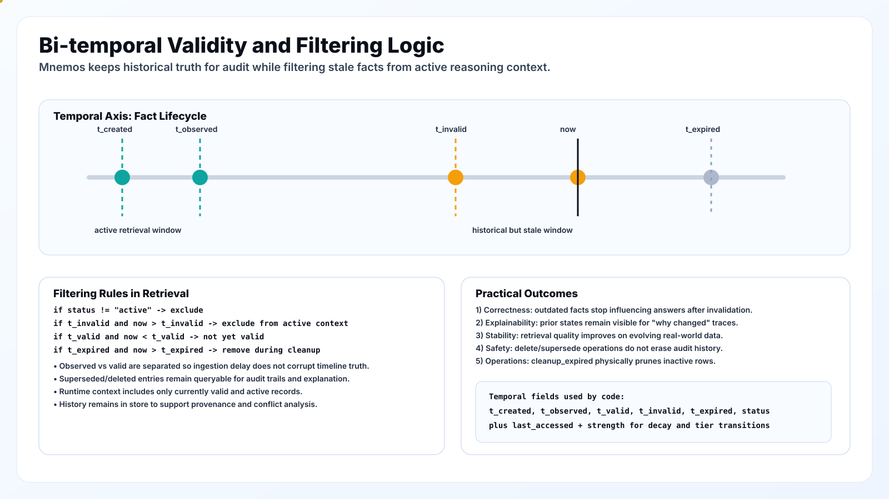
</p>

---

## Self-Editing Memory and Conflict Resolution

Every `memorize()` call evaluates against existing state and picks one of four actions:

| Action | When | Effect |
|:---|:---|:---|
| **ADD** | New fact, no conflict | Creates a new entry with `status="active"` |
| **UPDATE** | Same entity, newer information | Old entry → `status="superseded"`, new entry with `version_of` link |
| **DELETE** | Contradiction detected | Old entry → `status="deleted"`, `t_expired` set |
| **NOOP** | Duplicate or irrelevant | No change to memory state |

This eliminates the "append-only rot" problem. Stale facts are actively retired, not just deprioritized.

**Conflict resolution flow:**

1. Generate abstract from incoming text.
2. Retrieve semantically similar existing memories.
3. For each candidate:
   - If entities overlap and information is newer → UPDATE.
   - If entities overlap and facts contradict → DELETE the old one + ADD the new one.
   - If no overlap → ADD.
   - If content is a semantic duplicate → NOOP.

---

## Hierarchical Tiers and Decay Mechanics

Memories exist in three tiers, inspired by human memory consolidation:

| Tier | Retention | Boost | Promotion Trigger |
|:---|:---|:---|:---|
| **Short** | Hours–days | 1.0× (base) | Auto on creation |
| **Mid** | Days–weeks | 1.2× boost | Repeated access + age > `short_to_mid_days` (default: 7) + strength > `short_to_mid_strength` (default: 3.0) |
| **Long** | Weeks–months | 1.4× boost | Age > `mid_to_long_days` (default: 30) + strength > `mid_to_long_strength` (default: 6.0) |

**Decay formula:**

```
strength(t) = initial_strength × exp(-λ × days_since_last_access)
```

Where `λ` (default 0.05) controls the decay rate.

**Demotion** (optional, enabled by default):
- Long → Mid: if `strength < long_to_mid_retention` (default: 0.35) after `demotion_grace_days` (default: 14)
- Mid → Short: if `strength < mid_to_short_retention` (default: 0.25)

**Cleanup:**
- `cleanup_expired()` removes entries where `strength < retention_threshold` (default: 0.2)
- TTL-based expiry: if `ttl_seconds` is set, entries older than TTL are removed regardless of strength

The `SleepConsolidationJob` runs periodic maintenance to promote, demote, and clean up memories — analogous to sleep-based memory consolidation in neuroscience.

---

## Retrieval, Fusion, and Ranking Math

### HybridRetriever — 6-Signal Scoring

The HybridRetriever scores every memory against six normalized signals:

```
S(q, m) = w_sem × φ_sem + w_bm25 × φ_bm25 + w_graph × φ_graph
         + w_decay × φ_decay + w_cw × φ_cw + w_tier × φ_tier
```

| Signal | Weight | Source | Formula |
|:---|:---:|:---|:---|
| **φ_sem** | 0.20 | Dense embeddings | Cosine similarity, min-max normalized to [0,1] |
| **φ_bm25** | 0.30 | Lexical index | BM25 score, min-max normalized to [0,1] |
| **φ_graph** | 0.15 | Neo4j PPR | Personalized PageRank score, min-max normalized |
| **φ_decay** | 0.15 | Temporal | `exp(-λ·days_old)`. Bypassed (set to 1.0) when raw BM25 > `decay_bypass_threshold` |
| **φ_cw** | 0.10 | Cognitive | `0.6 × salience + 0.4 × (fsrs_stability / max_stability)` |
| **φ_tier** | 0.10 | Memory tier | Short=1.0, Mid=1.2, Long=1.4 (normalized) |

**Key design decisions:**

- BM25 gets the highest weight (0.30) because lexical precision matters most for factual retrieval.
- Time decay has a BM25 bypass: if a memory scores very high on exact term match (> 2.0 raw BM25), it survives regardless of age. This prevents precise but old facts from being penalized.
- The cognitive signal blends emotional salience (from `EmotionalSalienceScorer`) with spaced-repetition strength (from FSRS), connecting retrieval to the cognitive enrichment pipeline.
- Tier boost rewards memories that have survived consolidation into long-term storage.
- All weights are fully configurable via `HybridRetrieverConfig`.

**Internal machinery:**

| Component | Purpose |
|:---|:---|
| `_Normalizer` | Tracks running min/max per signal, applies min-max normalization to [0,1] |
| `_HitAccumulator` | Deduplicates by page_id, aggregates raw scores per signal, applies weighted sum |
| `_resolve_entry()` | Maps Hit → Page → memory_id → MemoryEntry to access tier, FSRS, salience fields |

<p align="center">
  
</p>

---

## Adaptive Context Manager

MemTier (arXiv:2605.03675) shows that k=2 entries at 300-600 tokens consistently outperforms larger retrieval budgets. More context does not mean better answers. The key is packing the *right* memories, not *all* memories.

The `AdaptiveContextManager` implements this insight with a 4-stage pipeline:

| Stage | What It Does |
|:---|:---|
| **1. Measure** | Exact token count via tiktoken (`cl100k_base`) — replaces naive `len//4` approximation |
| **2. Dedup** | Character trigram Jaccard similarity (threshold 0.60) — skips near-duplicate content |
| **3. Pack** | Greedy best-first by retrieval score — add memories until budget exhausted |
| **4. Compress** | LLM distillation fallback — when total candidate tokens exceed 1.5× budget, compress via generator |

```python
from mnemos import AdaptiveContextManager, ContextManagerConfig

ctx = AdaptiveContextManager(
    max_tokens=2000,               # token budget
    tiktoken_model="cl100k_base",  # precise counting
    generator=generator,           # for compression fallback
    dedup_threshold=0.60,          # trigram Jaccard threshold
)
context_str = ctx.pack(hits, memory_store, profile_context="Senior engineer, Go + React stack")
```

Output format:
```
[Profile] Senior engineer, Go + React stack
[Memory 1 — score: 0.87] The project deadline is March 15th...
[Memory 2 — score: 0.73] The client prefers monthly billing...
```

The `ResearchAgent` delegates to `context_manager.pack()` when available, falling back to the legacy `_build_memory_context()` path otherwise.

<p align="center">
  
</p>

---

## ECL Pipeline

Inspired by [Cognee](https://github.com/topoteretes/cognee)'s ECL architecture, the ECLPipeline enriches every memory at write-time with cognitive metadata:

| Phase | What Happens |
|:---|:---|
| **Extract** | Parse raw input via loaders (TextFile, Directory, URL, JSONL, S3, Notion, GDrive) + chunking with SHA-256 content dedup |
| **Cognify** | Score emotional salience (0.0–1.0) via `EmotionalSalienceScorer`, initialize FSRS baselines (`fsrs_stability`, `fsrs_difficulty`, `fsrs_next_review`) |
| **Load** | Commit enriched chunks to memory via `memorize()` — atomic write to memory store + page store + graph |

```python
from mnemos import ECLPipeline, EmotionalSalienceScorer, SpacedRepetitionScheduler

pipeline = ECLPipeline(
    salience_scorer=EmotionalSalienceScorer(generator=generator),
    scheduler=SpacedRepetitionScheduler(),
)
results = pipeline.ingest(
    loader=my_loader,
    agent=memory_agent,
    memory_store=memory_store,
    page_store=page_store,
)
```

Both cognitive enrichments are optional — omit them for backward-compatible basic ingestion:

```python
basic_pipeline = ECLPipeline()  # works identically to IngestionPipeline
```

**Why ECL matters:** Previously, `EmotionalSalienceScorer` and `SpacedRepetitionScheduler` existed as separate modules but were never wired into the ingestion flow. ECLPipeline connects them so every memory has cognitive metadata from birth — which feeds directly into the HybridRetriever's φ_cw signal.

<p align="center">
  
</p>

---

## Graph Memory and Knowledge Semantics

Neo4j-backed knowledge graph with three entity tiers:

| Tier | What It Stores | Example |
|:---|:---|:---|
| **Episode** | Raw observations with temporal bounds | "User said project deadline is March 15" |
| **Semantic Fact** | Extracted entity-relation-entity triples | `(Project, has_deadline, March 15)` |
| **Community** | Summarized clusters of related facts | "Project timeline summary: deadline March 15, review March 10..." |

**Graph operations:**

| Operation | What It Does |
|:---|:---|
| `add_episode()` | Store raw observation as Episode node |
| `extract_and_link()` | Parse entities and relations, create Fact nodes with edges |
| `link_memory_relation()` | Create typed edges between memory nodes (uses regex allowlist for Cypher injection safety) |
| `get_neighborhood()` | Entity-seeded subgraph expansion with configurable depth |
| `personalized_pagerank()` | PPR-based relevance scoring from seed entities |
| `community_detection()` | Cluster related facts into Community summary nodes |

**Provenance:** Every Fact node links back to its source Episode via `EXTRACTED_FROM` edges, enabling full traceability from summary → fact → raw observation.

The `GraphRetriever` wraps these operations for the retrieval pipeline, producing hits scored by PPR proximity that feed into the HybridRetriever's φ_graph signal.

<p align="center">
  
</p>

---

## Ingestion Pipeline and Document Processing

### Loaders

| Loader | Source | Key Options |
|:---|:---|:---|
| `TextFileLoader` | Local text files | Encoding, glob patterns |
| `DirectoryLoader` | Recursive directory scan | File extensions filter |
| `URLLoader` | Web pages | HTTPS enforced by default, `allow_http` opt-in |
| `JSONLLoader` | JSONL files | Field mapping |
| `S3Loader` | AWS S3 buckets | Bucket, prefix, credentials |
| `NotionLoader` | Notion pages | API token, page IDs |
| `GDriveLoader` | Google Drive | Credentials, folder ID |

### Chunking

```python
from mnemos import SimpleChunker, ChunkingConfig

chunker = SimpleChunker(ChunkingConfig(
    chunk_size=512,
    chunk_overlap=50,
    separators=["\n\n", "\n", ". "],
))
chunks = chunker.chunk(document)
```

### Pipelines

| Pipeline | Enrichment | Use When |
|:---|:---|:---|
| `IngestionPipeline` | Basic (load + chunk + deduplicate + memorize) | Simple ingestion without cognitive features |
| `ECLPipeline` | Full (load + chunk + deduplicate + salience + FSRS + memorize) | Production use with cognitive enrichment |

Both pipelines use SHA-256 content hashing for deduplication — already-ingested chunks are skipped automatically.

<p align="center">
  
</p>

---

## User Profile Modeling

The `UserProfile` system builds adaptive models of users over time:

- **UserProfile** — Stores preferences, knowledge level, communication style, and domain interests.
- **UserProfileStore** — Persists profiles with versioning.
- **UserProfileAgent** — LLM-driven agent that updates profiles based on interaction signals.

Profiles feed into the `AdaptiveContextManager` as `profile_context`, allowing the research agent to tailor answers to the user's expertise level and interests.

---

## Maintenance Jobs: Consolidation and Summarization

### SleepConsolidationJob

Runs periodic maintenance analogous to sleep-based memory consolidation:

- **Promote:** Short → Mid → Long based on age and strength thresholds.
- **Demote:** Long → Mid → Short when strength decays below retention thresholds.
- **Cleanup:** Remove expired entries below retention threshold.
- **Consolidate:** Merge related short-term memories into consolidated long-term entries using `MemoryConsolidator`.

### MemoryConsolidator

Uses the LLM to detect and resolve relationships between memories:

- **Redundancy:** Near-identical memories → keep the more complete one, delete the other.
- **Contradiction:** Conflicting facts → keep the newer one, delete the older.
- **Complementarity:** Related facts → merge into a consolidated summary.

### HierarchicalSummarizer

Multi-level summarization for long memory chains:

- Level 0: Individual memory entries.
- Level 1: Cluster summaries (groups of related entries).
- Level 2: Topic summaries (groups of clusters).
- Level 3: Global summary (full memory state).

---

## Reliability: Async, Checkpointing, Replay

### CheckpointManager

Save and restore memory state snapshots:

```python
from mnemos import CheckpointManager

ckpt = CheckpointManager(dir_path="./checkpoints")
ckpt.save(memory_store, page_store, label="before_migration")
# ... make changes ...
ckpt.restore(memory_store, page_store, label="before_migration")
```

### ExperienceReplayBuffer

Replay buffer for reinforcement-style memory training:

- Stores (state, action, reward, next_state) tuples from memory operations.
- Enables offline analysis of which memorize() decisions were effective.
- Supports prioritized replay based on reward signal.

### Thread Safety

- `AdvancedMemoryStore` uses `threading.RLock()` for all state mutations.
- `cleanup_expired()` acquires lock before modifying entry list.
- File persistence uses `atomic_write_json()` + `file_lock()` for crash safety.

---

## Evaluation and Testing

```bash
# Unit tests
python3 -m pytest -q

# Full test suite (unit + optional live E2E)
./scripts/test_all.sh

# Stress test (requires API keys)
python3 scripts/e2e_stress_live_test.py

# Install dev + eval extras
pip install -e ".[dev,eval]"
```

### RAGAS Evaluator

Integration with the RAGAS framework for evaluating retrieval quality:

```python
from mnemos import RAGASEvaluator

evaluator = RAGASEvaluator()
results = evaluator.evaluate(
    questions=["What is the project deadline?"],
    ground_truths=["March 15th"],
    research_agent=research_agent,
)
```

---

<a id="configuration-reference"></a>
## Configuration Reference

### Environment Variables

| Variable | Required | Default | Purpose |
|:---|:---:|:---|:---|
| `OPENROUTER_API_KEY` | Yes | — | LLM generation |
| `OPENROUTER_BASE_URL` | No | `https://openrouter.ai/api/v1` | API endpoint |
| `MNEMOS_API_KEY` | No | Falls back to `OPENROUTER_API_KEY` | Override for MNEMOS-specific key |
| `MNEMOS_BASE_URL` | No | Falls back to `OPENROUTER_BASE_URL` | Override for MNEMOS-specific endpoint |
| `MNEMOS_MODEL` | No | `google/gemini-3-flash-preview` | Default LLM model |
| `MNEMOS_DIR_PATH` | No | — | Directory for persistent memory state |
| `MNEMOS_AUDIT_LOG` | No | `./audit.log` | Path for GDPR audit log |
| `COHERE_API_KEY` | No | — | Cohere embeddings + reranking |
| `COHERE_BASE_URL` | No | `https://api.cohere.com` | Cohere API endpoint |
| `NEO4J_URI` | No | — | Neo4j connection URI |
| `NEO4J_USERNAME` | No | — | Neo4j auth username |
| `NEO4J_PASSWORD` | No | — | Neo4j auth password |
| `NEO4J_DATABASE` | No | — | Neo4j database name |

### Config Dataclasses

| Config | Module | Key Parameters |
|:---|:---|:---|
| `OpenAIGeneratorConfig` | `mnemos.config` | `model_name`, `api_key`, `base_url`, `temperature`, `max_tokens` |
| `VLLMGeneratorConfig` | `mnemos.config` | `model_name`, `base_url`, `max_tokens` |
| `HybridRetrieverConfig` | `mnemos.config` | `weights` (6-signal dict), `decay_lambda`, `decay_bypass_threshold`, `top_k` |
| `ContextManagerConfig` | `mnemos.config` | `max_tokens`, `tiktoken_model`, `dedup_threshold` |
| `IndexRetrieverConfig` | `mnemos.config` | `index_dir` |
| `DenseRetrieverConfig` | `mnemos.config` | `model_name`, `batch_size`, `max_length`, `trust_remote_code` |
| `BM25RetrieverConfig` | `mnemos.config` | `index_dir`, `threads` |
| `CohereEmbedRetrieverConfig` | `mnemos.config` | `model_name`, `api_key`, `input_type_doc/query` |
| `CohereRerankerConfig` | `mnemos.config` | `model_name`, `top_k` |

### AdvancedMemoryStore Parameters

| Parameter | Default | Purpose |
|:---|:---:|:---|
| `dir_path` | `None` | Persistence directory (None = in-memory only) |
| `enable_auto_cleanup` | `True` | Auto-run `cleanup_expired()` on load |
| `ttl_seconds` | `None` | Hard TTL for all entries |
| `retention_threshold` | `0.2` | Minimum strength before cleanup |
| `short_to_mid_days` | `7` | Days before eligible for mid promotion |
| `mid_to_long_days` | `30` | Days before eligible for long promotion |
| `short_to_mid_strength` | `3.0` | Strength required for mid promotion |
| `mid_to_long_strength` | `6.0` | Strength required for long promotion |
| `demotion_enabled` | `True` | Allow tier demotion |
| `demotion_grace_days` | `14` | Grace period before demotion |
| `long_to_mid_retention` | `0.35` | Strength threshold for long→mid demotion |
| `mid_to_short_retention` | `0.25` | Strength threshold for mid→short demotion |
| `retain_history` | `True` | Keep version history for updates |

---

## Repository Structure

```
mnemos/
├── agents/              # MemoryAgent + ResearchAgent
│   ├── memory_agent.py  #   memorize() with self-editing lifecycle
│   └── research_agent.py#   research() with PSIR loop
├── affect/              # Cognitive scoring
│   ├── salience.py      #   EmotionalSalienceScorer, FadingAffectModel
│   └── __init__.py
├── cloud/               # Multi-tenant support
│   └── tenants.py       #   Tenant isolation, usage metering
├── config/              # All config dataclasses
│   ├── generator.py     #   OpenAI, vLLM configs
│   ├── retriever.py     #   Dense, BM25, Cohere, Hybrid, ContextManager configs
│   └── __init__.py
├── evaluation/          # RAGAS evaluator integration
├── generator/           # LLM backends
│   ├── openai_gen.py    #   OpenAI-compatible (OpenRouter, etc.)
│   └── vllm_gen.py      #   vLLM self-hosted
├── graph/               # Neo4j knowledge graph
│   ├── graph_store.py   #   GraphMemoryStore, Cypher queries, PPR
│   └── ontology.py      #   GraphOntology definitions
├── ingestion/           # Document processing
│   ├── loaders.py       #   TextFile, URL, S3, Notion, GDrive, JSONL
│   ├── chunking.py      #   SimpleChunker with configurable overlap
│   ├── pipeline.py      #   IngestionPipeline (basic)
│   └── ecl_pipeline.py  #   ECLPipeline (Extract, Cognify, Load)
├── integrations/        # Framework adapters
│   └── __init__.py      #   MnemosLangchainMemory, mnemos_memorize, mnemos_research
├── learning/            # Experience replay buffer
├── maintenance/         # Background jobs
│   ├── consolidation.py #   MemoryConsolidator (LLM-driven merge)
│   └── sleep.py         #   SleepConsolidationJob (promote/demote/cleanup)
├── mcp/                 # Model Context Protocol
│   └── server.py        #   MCP tool endpoints with lazy init
├── modalities/          # Multi-modal
│   └── images.py        #   ImageMemoryProcessor
├── multi_agent/         # Multi-agent coordination
├── privacy/             # GDPR compliance
│   ├── erasure.py       #   ErasureEngine with hard_delete_entry()
│   └── audit.py         #   Audit logging (configurable path)
├── profile/             # User modeling
│   ├── user_profile.py  #   UserProfile, UserProfileStore
│   └── agent.py         #   UserProfileAgent (LLM-driven updates)
├── prompts/             # Prompt templates
├── reinforcement/       # Spaced repetition
│   └── fsrs.py          #   SpacedRepetitionScheduler (FSRS algorithm)
├── retriever/           # Search engines
│   ├── base.py          #   AbsRetriever interface
│   ├── index_retriever.py#  Direct page index access
│   ├── bm25.py          #   BM25 keyword retrieval (pyserini)
│   ├── dense_retriever.py#  Dense vector retrieval (BGEM3)
│   ├── cohere_dense.py  #   Cohere embed-v4.0 retrieval
│   ├── cohere_rerank.py #   Cohere rerank-v4.0-pro
│   ├── graph_retriever.py#  Neo4j PPR-based retrieval
│   ├── hybrid.py        #   HybridRetriever (6-signal fusion)
│   └── context.py       #   AdaptiveContextManager (token packing)
├── schemas/             # Data models
│   ├── advanced_memory.py#  MemoryEntry, AdvancedMemoryStore, AdvancedMemoryState
│   ├── memory.py        #   MemoryState, MemoryUpdate
│   ├── page.py          #   Page, InMemoryPageStore
│   ├── search.py        #   Hit, SearchPlan, Result
│   └── ttl.py           #   TTLMemoryStore, TTLMemoryEntry, TTLPageStore
├── server/              # HTTP layer
│   ├── main.py          #   FastAPI app with lifespan context manager
│   ├── routes.py        #   POST /memories, POST /research, GET /memories, DELETE /users/{id}/erase
│   ├── deps.py          #   Dependency injection (generator, agents, retrievers)
│   ├── metrics.py       #   Prometheus metrics (latency, count, errors)
│   └── models.py        #   Request/response Pydantic models
├── summarization/       # Hierarchical summarizer
├── utils/               # Utilities
│   ├── checkpoint.py    #   CheckpointManager
│   ├── json_utils.py    #   extract_json_object (robust LLM output parsing)
│   ├── atomic_io.py     #   atomic_write_json (crash-safe persistence)
│   ├── file_lock.py     #   Cross-process file locking
│   └── retry.py         #   retry_call with exponential backoff
└── __init__.py          # Top-level exports (all public classes)

examples/quickstart/     # basic_usage.py, model_usage.py, ttl_usage.py
eval/                    # Evaluation entrypoints
tests/                   # Unit + integration tests (38 passing)
scripts/                 # run_maintenance.py, e2e_stress, neo4j_local_up/down, test_all.sh
dashboard/               # Streamlit observability dashboard
assets/readme/           # 11 SVG architecture diagrams + 6 PNG frames + package SVGs
.github/workflows/       # CI pipeline (pytest + lint)
```

---

## Operational Playbook for Production

### Development profile

- Local development prefix: `./`
- OpenRouter for generation.
- Listen on `localhost:8000` for FastAPI server.
- In-memory page store + on-disk memory store (set `MNEMOS_DIR_PATH`).
- Request limits for memory, pages, profiles, checkpoints.

### Observability metrics

MNEMOS exports Prometheus metrics via `mnemos.server.metrics`:

**Memory health:**
- `mnemos_active_entries` (gauge) — current active memory count
- `operation_distribution` (`add/update/delete/noop`) — per operation counts
- `active_vs_expired_memory_counts` — health ratio
- `tier_distribution_over_time` — short/mid/long balance

**Retrieval:**
- `per_channel_hit_contribution` — which retrievers contribute most
- `average_RRF_spread` — fusion diversity score
- `reranker_fliprate_delta` — how often reranking changes order
- `context_token_fill_ratio` — how much of the budget is used

**Ingestion:**
- `end_to_end_ingest_latency` — pipeline timing
- `p50/p95_retrieval_latency_by_channel` — per-retriever performance
- `dedup_count_distribution` — how many chunks are skipped
- `salience_score_distribution` — ECL cognitive enrichment stats

**System:**
- `active_consolidation_jobs_in_flight` — maintenance job monitoring
- `memory_count_over_time` — growth trend

### Suggested observability metrics

Dashboards to configure:

| Category | Metric | Why |
|:---|:---|:---|
| Memory health | active/expired ratio | Detect accumulation of stale state |
| Retrieval | per-channel contribution | Verify all channels contribute |
| Retrieval | token fill ratio | Ensure context budget is used efficiently |
| Ingestion | salience distribution | Verify cognitive enrichment quality |
| System | memory count trend | Capacity planning |

### Data governance checklist

- [ ] Rotate API keys from memory endpoints.
- [ ] Encrypt profile files and encryption store payloads.
- [ ] Ensure `hard_delete_entry()` is used for GDPR Article 17 requests.
- [ ] Implement retention policies for profile and replay artifacts.

---

## Performance Tuning Guide

### If latency is too high

1. Reduce `max_iters` to fewer research iterations (default: 3).
2. Disable reranker or lower `CohereRerankerConfig.top_k`.
3. Use `IndexRetriever` alone instead of full HybridRetriever.
4. Keep graph depth small via `get_neighborhood(depth=1)`.
5. Lower context budget: `ContextManagerConfig(max_tokens=1000)`.
6. Use a faster LLM model.

### If answer quality is weak

1. Increase `max_iters` to allow more research iterations.
2. Keep full BM25 enabled for lexical precision.
3. Ensure `enable_self_rag=True` for self-reflective retrieval.
4. Enable reranker (`CohereRerankerConfig`).
5. Improve cognition: run ECL pipeline with both salience and FSRS.
6. Inspect negative degradation in scoring and relevance quality.

### If memory grows too fast

1. Enable `enable_auto_cleanup=True` (default).
2. Reduce `retention_threshold` to be more aggressive with cleanup.
3. Set `ttl_seconds` for hard TTL on all entries.
4. Enable `demotion_enabled=True` to demote inactive memories.
5. Run `SleepConsolidationJob` more frequently to consolidate short-term memories.

### If stale facts leak into answers

1. Validate `t_valid` and `t_invalid` semantic window quality.
2. Enable `query_as_of()` for temporal filtering.
3. Verify self-editing lifecycle is working (check for UPDATE/DELETE operations).
4. Increase conflict detection sensitivity in memorize() prompts.
5. Consider periodic full-consolidation runs.

---

## Known Gaps and Recommended Next Steps

MNEMOS is deliberately a working architecture that makes modern Python + LLM tooling possible, but the following improvements would make it even more production-ready:

1. Expand automated tests beyond TTL; validate adding a ground-truth harness for fully reproducible end-to-end scenarios.
2. Improve evaluation coverage with RAGAS benchmarks on standard datasets.
3. Add persistent page store options (SQLite, PostgreSQL) beyond in-memory.
4. Implement proper RBAC for multi-tenant deployments.
5. Add explicit benchmark suite for retrieval quality across signal combinations.
6. Add multi-modal memory for images, audio, and structured data.
7. Add explicit caching for embedding computations in high-throughput scenarios.
8. Add MNEMOS wrapper for agentic frameworks like AutoGen and CrewAI (LangChain adapter exists).

---

## FAQ

### Is MNEMOS only a graph memory system?

No. Graph is one channel. The system is intentionally hybrid: dense + sparse + index + graph. Graph features are skipped and non-graph retrieval channels still work when Neo4j is not configured.

### Does MNEMOS support append-only mode?

Yes. While the default approach is the full self-editing lifecycle (ADD/UPDATE/DELETE/NOOP), you can use `InMemoryMemoryStore` or `TTLMemoryStore` for simpler append-based memory without the advanced conflict resolution. The advanced features are designed for the `AdvancedMemoryStore`.

### Why keep both memory store and page store?

**Separation of concerns.** The memory store holds structured `MemoryEntry` objects with temporal fields, tiers, and lifecycle status. The page store holds indexable `Page` objects optimized for retrieval. This separation means retrieval indexes don't need to understand memory lifecycle semantics, and memory management doesn't need to know about embedding formats.

### Is Neo4j mandatory?

No. Neo4j is optional. When graph-related environment variables are absent, graph features are skipped and non-graph retrieval channels (dense, BM25, index) still work. The `GraphRetriever` simply returns empty results.

### Is this OpenAI only?

No. The generator is OpenAI-compatible API based, with `OpenRouter` defaults and vLLM compatibility in the `VLLMGenerator`. Generator configuration supports any model accessible via the OpenAI-compatible API format (Claude, Gemini, Llama, Mistral, etc. via OpenRouter).

### How does the 6-signal scoring compare to standard RAG?

Standard RAG typically uses a single retrieval signal (usually dense embeddings) with optional reranking. MNEMOS fuses six signals — each capturing a different quality dimension — before reranking. This means a memory can score well even if one signal fails (e.g., semantically similar but lexically different), making retrieval more robust across diverse query types.

### What's the difference between IngestionPipeline and ECLPipeline?

`IngestionPipeline` loads, chunks, deduplicates, and memorizes — basic ingestion. `ECLPipeline` adds the "Cognify" step between Extract and Load: scoring emotional salience and initializing FSRS baselines. Both have the same interface; ECLPipeline is a drop-in upgrade.

---

## Architecture SVGs

Full animated architecture diagrams (1600x900, Inter font, teal/amber theme):

<details>
<summary><b>System Overview</b></summary>
<p align="center"></p>
</details>

<details>
<summary><b>Request Lifecycle</b></summary>
<p align="center"></p>
</details>

<details>
<summary><b>Memory Lifecycle</b></summary>
<p align="center"></p>
</details>

<details>
<summary><b>Bi-Temporal Model</b></summary>
<p align="center"></p>
</details>

<details>
<summary><b>Retrieval Fusion Pipeline</b></summary>
<p align="center">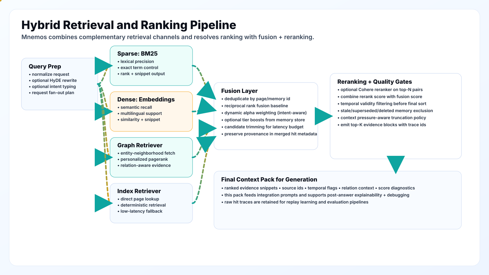</p>
</details>

<details>
<summary><b>3-Tier Graph Memory</b></summary>
<p align="center"></p>
</details>

<details>
<summary><b>Ingestion Pipeline</b></summary>
<p align="center"></p>
</details>

<details>
<summary><b>Repository Capabilities Map</b></summary>
<p align="center">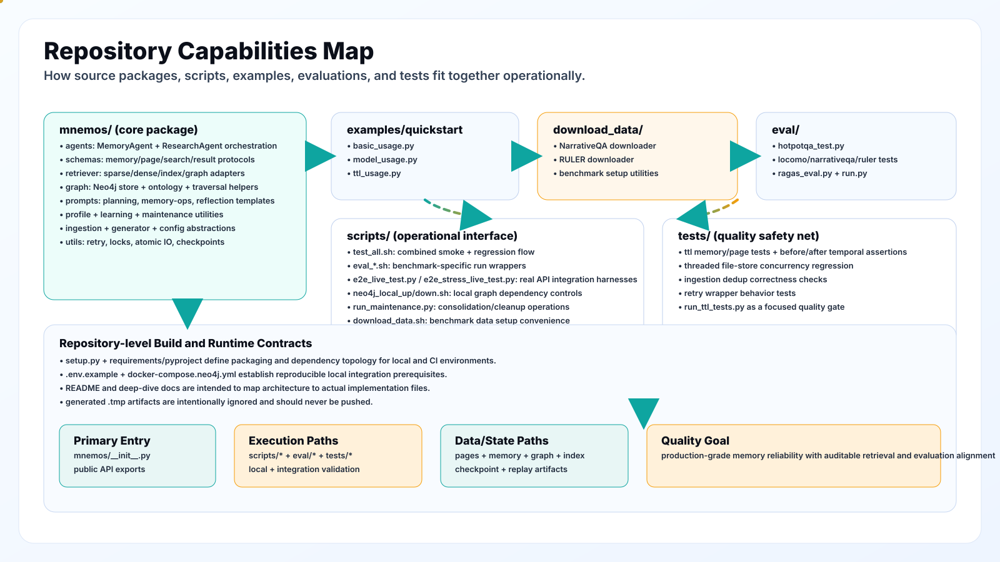</p>
</details>

<details>
<summary><b>HybridRetriever — 6-Signal Scoring</b></summary>
<p align="center"></p>
</details>

<details>
<summary><b>AdaptiveContextManager</b></summary>
<p align="center"></p>
</details>

<details>
<summary><b>ECL Pipeline</b></summary>
<p align="center"></p>
</details>

<details>
<summary><b>Package Architecture (mnemos/ internals)</b></summary>
<p align="center"></p>
</details>

<details>
<summary><b>Memory Write Sequence</b></summary>
<p align="center"></p>
</details>

<details>
<summary><b>Research Runtime Sequence</b></summary>
<p align="center"></p>
</details>

<details>
<summary><b>Schema Relations</b></summary>
<p align="center"></p>
</details>

<details>
<summary><b>Retrieval Scoring Engine</b></summary>
<p align="center"></p>
</details>

<details>
<summary><b>Graph Semantics CRUD</b></summary>
<p align="center"></p>
</details>

---

## Additional Capabilities

| Capability | Module | Description |
|:---|:---|:---|
| **GDPR Erasure** | `mnemos.privacy` | `hard_delete_entry()` for Article 17 compliance + audit logging |
| **MCP Server** | `mnemos.mcp` | Model Context Protocol for tool-use agents |
| **FastAPI Server** | `mnemos.server` | REST API: POST /memories, POST /research, GET /memories, DELETE /users/{id}/erase |
| **Prometheus Metrics** | `mnemos.server.metrics` | Request latency, memory count, error rate |
| **Streamlit Dashboard** | `dashboard/` | Real-time memory observability |
| **LangChain Integration** | `mnemos.integrations` | Drop-in `MnemosLangchainMemory` adapter |
| **Multi-Tenant** | `mnemos.cloud` | Tenant isolation for SaaS deployments |
| **Image Memory** | `mnemos.modalities` | Visual content processing and storage |
| **Experience Replay** | `mnemos.learning` | Replay buffer for reinforcement-style memory training |
| **Hierarchical Summarization** | `mnemos.summarization` | Multi-level compression for long memory chains |
| **User Profiling** | `mnemos.profile` | Adaptive user modeling with profile agent |
| **Checkpointing** | `mnemos.utils` | Save/restore memory state snapshots |

---

## Additional Documentation in This Repo

- `CHANGELOG_BUGFIX.md`
- `CHANGELOG_PHASE7.md`
- `docs/`
- `eval/`
- `scripts/`

---

## License

MIT. Licensed for commercial and research use. See [LICENSE](LICENSE).

---

## Acknowledgments

MNEMOS is an open-source AI agent memory system that makes modern Python + LLM tooling possible.

### Research Foundations

- **MemTier** ([arXiv:2605.03675](https://arxiv.org/abs/2605.03675)) — Multi-signal retrieval fusion, tiered memory architecture, token-budget optimization
- **Cognee** ([github](https://github.com/topoteretes/cognee)) — ECL (Extract, Cognify, Load) ingestion pattern
- **Mem0** ([github](https://github.com/mem0ai/mem0)) — Developer experience patterns for memory APIs
- **FSRS** — Free Spaced Repetition Scheduler for memory strength modeling
- **Bi-temporal databases** — Temporal validity and point-in-time query semantics

### Built On

- [OpenAI API](https://platform.openai.com/) (via OpenRouter)
- [Cohere](https://cohere.com/) (embeddings + reranking)
- [Neo4j](https://neo4j.com/) (graph memory)
- [FastAPI](https://fastapi.tiangolo.com/) (HTTP server)
- [tiktoken](https://github.com/openai/tiktoken) (token counting)
- [Pydantic](https://docs.pydantic.dev/) (data validation)
- [Prometheus](https://prometheus.io/) (observability)

---

## Support

- **Repo:** [github.com/DevChiniwala/MNEMOS](https://github.com/DevChiniwala/MNEMOS)
- **Author:** [Dev Chiniwala](https://github.com/DevChiniwala)
- Report issues: open a GitHub issue with repro steps, logs, and your config (redact secrets).

<div align="center">
<br/>

**MNEMOS** — Memory that edits itself, retrieves with precision, and improves over time.

<br/>
</div>
